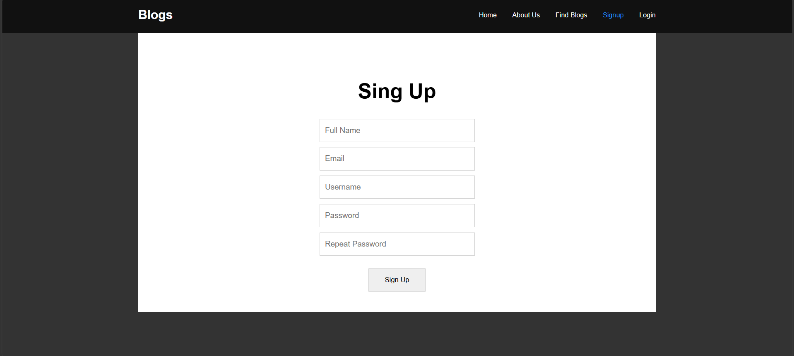
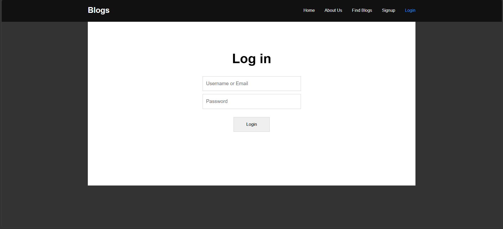

# PHP Blogs — Session-Based Auth & Blog Starter

**Repository:** [github.com/0xElghobashy/php-auth-blog](https://github.com/0xElghobashy/php-auth-blog)

A lightweight PHP + MySQL project implementing session-based user authentication (signup, login, logout) on top of a simple blog homepage layout. Built as a hands-on project to practice core PHP web development: procedural includes, sessions, form handling, and secure database access with prepared statements.

## Screenshots

| Signup | Login |
|---|---|
|  |  |

## Features

- **Session-based auth state** — navbar dynamically shows Login/Signup or My Profile/Logout depending on `$_SESSION`
- **Signup** — full name, email, username, password + repeat, with server-side validation:
  - Required-field check
  - Username format check (`a-zA-Z0-9` only)
  - Email format check via `filter_var(FILTER_VALIDATE_EMAIL)`
  - Password match check
  - Duplicate username/email check before insert
- **Login** — username/email + password, with required-field and credential checks
- **Logout** — destroys the PHP session and redirects home
- **Password security** — passwords hashed with `password_hash()` (bcrypt via `PASSWORD_DEFAULT`) and verified with `password_verify()`
- **SQL injection protection** — all database queries use `mysqli` prepared statements (`mysqli_stmt_prepare` / `bind_param`), never raw string interpolation
- Shared `header.php` / `footer.php` layout included across all pages

## Technologies Used

| Layer | Technology |
|---|---|
| Language | PHP (procedural, `mysqli` extension) |
| Database | MySQL |
| Frontend | HTML5, CSS3 (`reset.css` + custom `style.css`), vanilla JavaScript |
| Fonts | Google Fonts (Aboreto) |
| Auth | PHP native sessions (`$_SESSION`), `password_hash()` / `password_verify()` |
| Local dev | Works with XAMPP or the PHP built-in server |

## Project Structure

```
.
├── header.php                    # Shared <head>, nav (auth-aware), opening <main>
├── footer.php                    # Closing </main>, scripts, </body></html>
├── index.php                     # Homepage — greets logged-in users, shows categories
├── login.php                     # Login form + inline error messages
├── signup.php                    # Signup form + inline error messages
├── includes/
│   ├── dbh.inc.php               # Database connection (mysqli)
│   ├── functions.inc.php         # Validation + auth helper functions
│   ├── login.inc.php             # Handles POST from login.php
│   ├── signup.inc.php            # Handles POST from signup.php
│   └── logout.inc.php            # Destroys session, redirects home
├── css/
│   ├── reset.css                 # CSS reset
│   └── style.css                 # Site styling
├── js/
│   └── main.js                   # Front-end scripting
├── img/
│   └── logo.jpg                  # Site logo
└── screenshots/
    ├── signup.png                # Signup page preview
    └── login.png                 # Login page preview
```

## Database Setup

Create a MySQL database and a `users` table matching the columns used in `includes/functions.inc.php`:

```sql
CREATE DATABASE phpproject01;

USE phpproject01;

CREATE TABLE users (
  usersID INT AUTO_INCREMENT PRIMARY KEY,
  usersName VARCHAR(100) NOT NULL,
  usersEmail VARCHAR(100) NOT NULL UNIQUE,
  usersUid VARCHAR(50) NOT NULL UNIQUE,
  usersPwd VARCHAR(255) NOT NULL
);
```

Update the credentials in `includes/dbh.inc.php` to match your local MySQL setup:

```php
$serverName = 'localhost';
$dBUsername = 'root';
$dBPassword = '';
$dBName = 'phpproject01';
```

## Getting Started

```bash
git clone https://github.com/0xElghobashy/php-auth-blog.git
cd php-auth-blog/
# Import the database schema above, then:
php -S localhost:8000
```

Open `http://localhost:8000` in your browser.

## Known Issues / Hardening Notes

This project prioritizes learning core PHP concepts; a few things to fix before treating it as production-ready:

- **Credentials in source** — `includes/dbh.inc.php` hardcodes DB credentials. Move these to environment variables or a git-ignored config file.
- **Unescaped output** — `index.php` prints `$_SESSION['userUid']` without `htmlspecialchars()`. Currently constrained by the signup username regex, but output should still be escaped defensively.
- **No CSRF protection** — the login/signup forms have no CSRF token.
- **Leftover debug code** — `includes/signup.inc.php` has a stray `echo 'hello world';` after the redirect logic.
- **No rate limiting** — login attempts aren't throttled, so brute-forcing isn't mitigated at the application level.

## License

Licensed under the MIT License — see [LICENSE](LICENSE).
